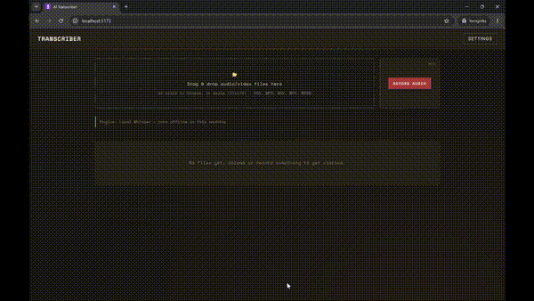
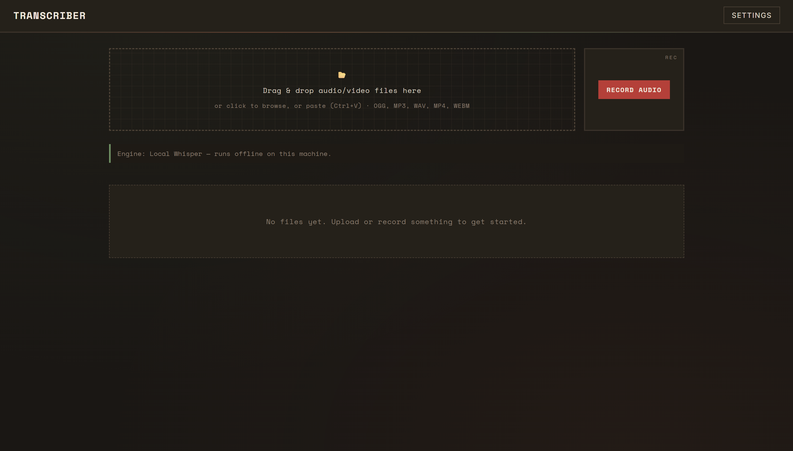
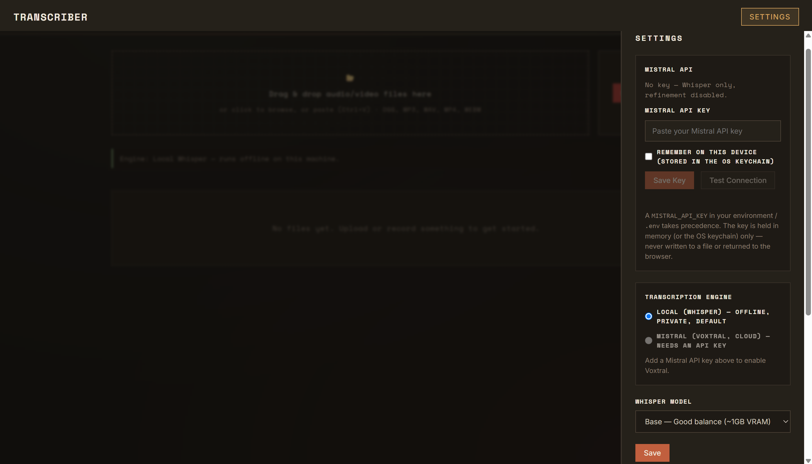
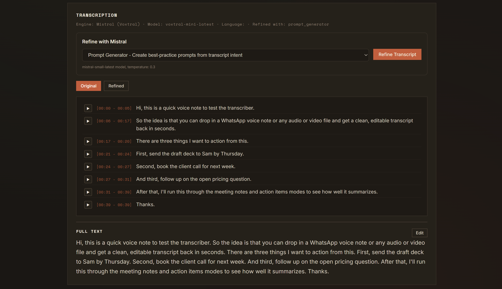

<p align="center"></p>

# Transcriber

A lightweight, local-first audio transcription app. It turns audio into text with **OpenAI Whisper running on your own machine**, and can optionally use **Mistral** for cloud transcription (Voxtral) and for refining transcripts into notes, action items, and more. It runs as a small FastAPI backend plus a React frontend — no Docker, no database, no cloud account required to get started. Built with AI-assisted coding (Claude Code and Mistral Vibe), Python/FastAPI and React.

## Demo



*Drop in a WhatsApp voice note or any audio/video file → transcribe locally with Whisper or via Mistral Voxtral → refine with Mistral → export to Word.*

## Features

- **Two transcription engines**
  - **Local (Whisper)** — the default. Runs fully offline; audio never leaves your machine.
  - **Mistral (Voxtral, cloud)** — optional, enabled once you add a Mistral API key.
- **Flexible input** — drag & drop, file browser, paste from clipboard (Ctrl+V), or record directly in the browser. Supports OGG, MP3, WAV, MP4, M4A, WEBM, FLAC, AAC.
- **Transcript view** — timestamped segments plus the full text.
- **Per-segment playback** — click ▶ on any segment to hear just that snippet of the audio.
- **Editable transcripts** — edit the text and save; the edited version becomes canonical for export and refinement.
- **Word export** — download any transcript (original, edited, or refined) as a `.docx`.
- **Refinement with Mistral** (optional) — post-process a transcript through one of five modes:
  | Mode | Best for | Output |
  |------|----------|--------|
  | Meeting Notes | Meetings, calls | Structured headed bullets |
  | Clean Transcript | Speeches, dictation | Natural, filler-free prose |
  | Action Items | Task capture | Structured JSON checklist |
  | Prompt Generator | Turning spoken intent into an LLM prompt | A well-formed prompt |
  | Custom | Anything | Follows your own instruction |
- **Secure API-key handling** — enter the key in Settings (masked) or via `.env`; test the connection; optionally remember it in your OS keychain. The key is never returned to the browser or written to a plaintext file.

Without a Mistral key, the app is a fully functional **offline Whisper transcriber** — the cloud engine and refinement simply stay disabled.

## Screenshots

| Home | Settings | Transcription |
| --- | --- | --- |
|  |  |  |

## Prerequisites

- **Python 3.10+**
- **Node.js 18+**
- **ffmpeg** on your PATH — Whisper uses it to decode audio. ([download](https://ffmpeg.org/download.html))

## Setup

```bash
# 1. Backend
cd backend
python -m venv venv
# Windows:
venv\Scripts\activate
# macOS/Linux:
source venv/bin/activate
pip install -r requirements.txt
cd ..

# 2. Frontend
cd frontend
npm install
cd ..
```

### Optional: Mistral API key

Needed only for the Voxtral engine and for refinement. The environment / `.env` takes precedence; the Settings field is an override.

- **`.env`** (recommended for a permanent setup) — create `.env` in the project root or `backend/`:
  ```
  MISTRAL_API_KEY=your_api_key_here
  ```
- **In the app** — open **Settings**, paste the key into the masked field, and Save. Tick **"Remember on this device"** to store it in your OS keychain; otherwise it lasts only for the session. Use **Test connection** to verify it.

Get a key from the [Mistral Console](https://console.mistral.ai/). See `.env.example` for the template.

## Running

**Windows (one command):**
```bash
start.bat
```
This starts the backend (http://127.0.0.1:8000) and frontend (http://localhost:5173) minimized and opens your browser.

**Any platform (manual):**
```bash
# Terminal 1 — backend (localhost only)
cd backend
venv\Scripts\python -m uvicorn main:app --host 127.0.0.1 --port 8000   # Windows
# python -m uvicorn main:app --host 127.0.0.1 --port 8000              # macOS/Linux

# Terminal 2 — frontend
cd frontend
npm run dev
```
Then open http://localhost:5173.

> The backend binds to `127.0.0.1` and CORS is restricted to the local frontend, so the app is not reachable from your network.

## Usage

1. **Add audio** — drag & drop, browse, paste, or record.
2. **Choose an engine** (optional) — Settings → Transcription Engine. Whisper is the default; Voxtral needs a key. The home page shows which engine is active and warns when audio will be sent to the cloud.
3. **Transcribe** — click *Transcribe* on a file; progress is shown while it runs.
4. **View / play / edit** — open the transcript, play any segment with ▶, or click *Edit* to correct the text and *Save*.
5. **Refine** (optional) — pick a mode under *Refine with Mistral* and run it; toggle between original and refined.
6. **Export** — download the transcript as `.docx`.

## Configuration

- **Whisper model** (Settings) — `tiny`, `base` (default), `small`, `medium`, `large`. Larger models are more accurate but slower and use more memory; the model downloads automatically on first use.
- **Transcription engine** (Settings) — Whisper (local) or Voxtral (cloud).
- **Environment** — `MISTRAL_API_KEY` (see above). Models and engine are persisted in `backend/settings.json`.

## Project structure

```
backend/
├── main.py                 # FastAPI app + settings/key endpoints
├── config.py               # paths, allowed types, limits, .env loader
├── models.py               # Pydantic models
├── routers/                # files, transcribe, export, refine
├── services/
│   ├── transcription_engines.py  # WhisperEngine + VoxtralEngine (pluggable)
│   ├── whisper_service.py        # local Whisper model loading/transcription
│   ├── mistral_client.py         # Mistral key store + chat + Voxtral STT
│   ├── refine.py                 # refinement mode registry + prompts
│   ├── file_service.py           # upload/recording/transcript storage
│   ├── docx_service.py           # .docx generation
│   └── settings_service.py       # settings persistence
└── tests/                  # lightweight unit tests

frontend/
├── src/
│   ├── api/client.js       # backend API calls
│   ├── components/         # FileList, TranscriptionView, RefinementPanel, ...
│   ├── hooks/              # useTranscription, useRefinement, useAudioRecorder
│   └── pages/              # HomePage, SettingsPanel
└── package.json
```

See [ARCHITECTURE.md](ARCHITECTURE.md) for the design and data flow.

## Tests

Backend unit tests (no API key or network required) use the standard library:

```bash
cd backend
venv\Scripts\python -m unittest discover -s tests   # Windows
# python -m unittest discover -s tests              # macOS/Linux
```

Frontend lint and build:

```bash
cd frontend
npm run lint
npm run build
```

## Privacy & security

- Audio and transcripts are stored locally under `backend/workspace/` and are git-ignored — nothing is committed.
- The Mistral API key is read from the environment/keychain/session only; it is never logged, returned to the browser, or written to a plaintext file.
- Mistral is contacted only when you select the Voxtral engine or run a refinement; the UI states plainly when audio will be uploaded.
- The server binds to localhost and CORS is limited to the local frontend.

## License

Released under the [MIT License](LICENSE).
